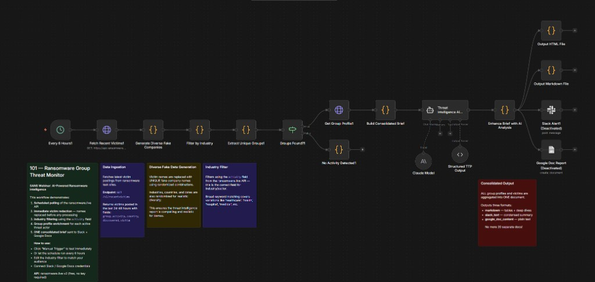
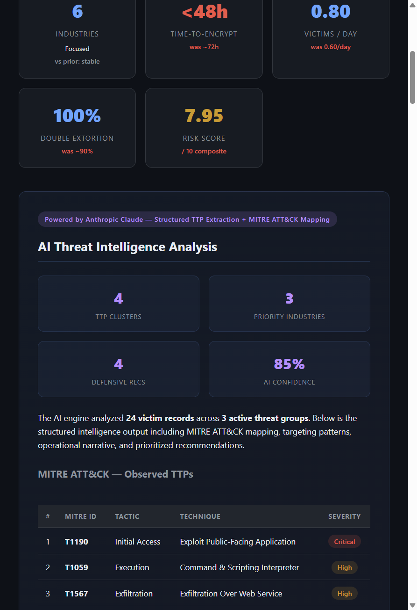
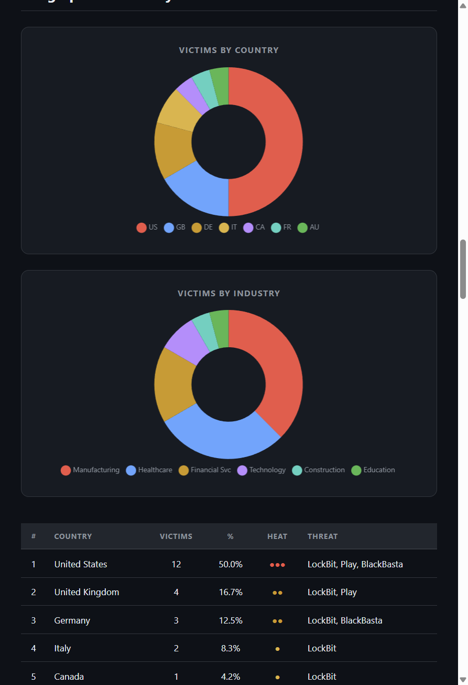
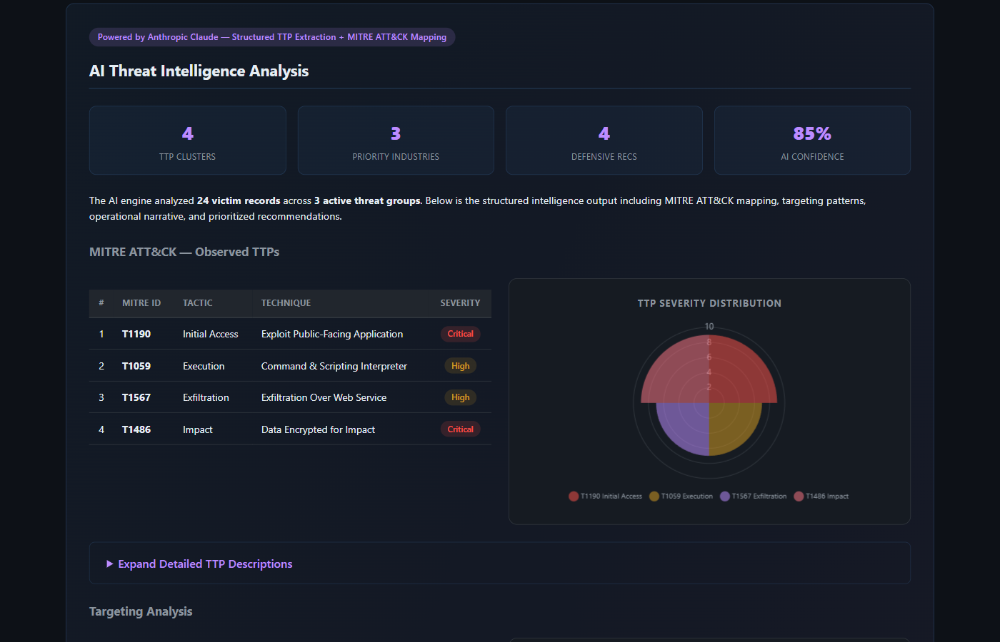
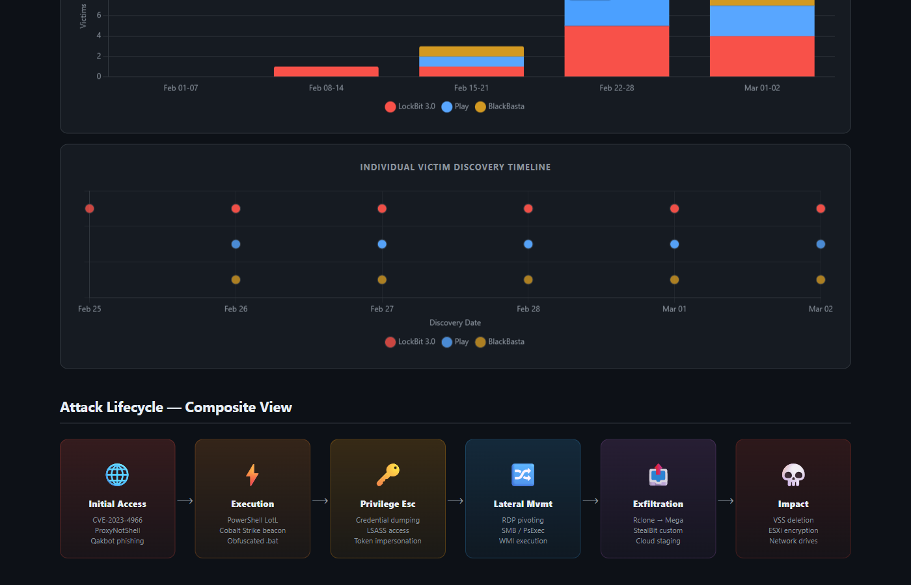
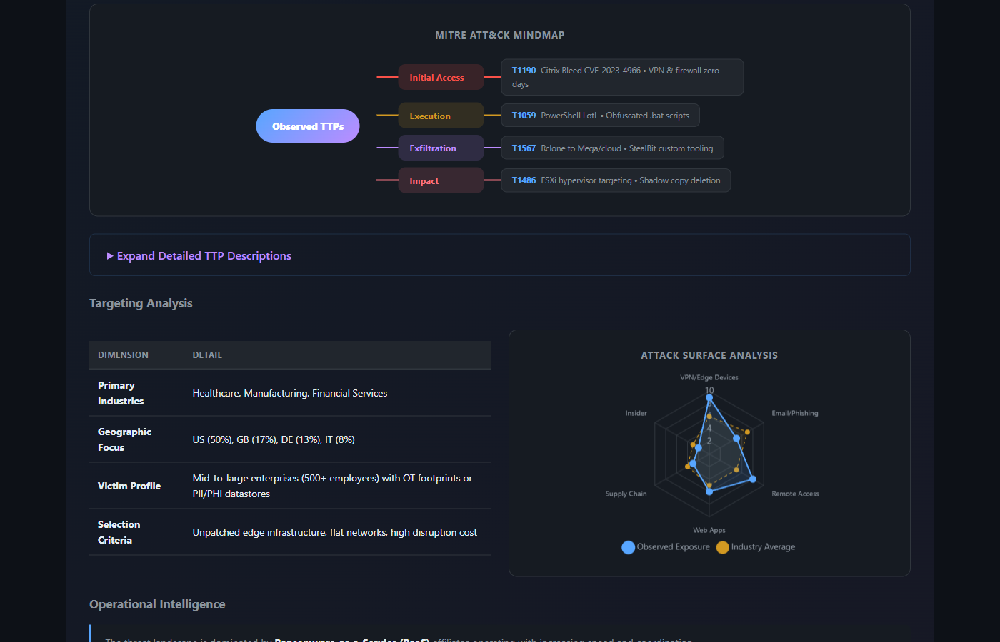

# 🛡️ AI-Powered Ransomware Intelligence Agent (n8n Workflows)

[](https://n8n.io/)
[](https://www.anthropic.com/)
[](https://ollama.ai/)
[](https://ransomware.live/)
[](https://creativecommons.org/licenses/by-nc/4.0/)

**Author:** Raymond DePalma &nbsp;|&nbsp; Companion to the **SANS Ransomware Intelligence Webinar**

Automated threat intelligence pipelines that continuously monitor ransomware leak sites, run AI-powered analysis, and deliver rich interactive reports — to Slack, Google Docs, and email.

---

## 🖼️ Preview

### n8n Workflow


### HTML Report — Dashboard


### HTML Report — Charts & Analysis



### HTML Report — Lifecycle & Mindmap



---

## 📊 Workflow Progression

| Level | File | LLM | Key Capabilities | Visibility |
|-------|------|-----|-----------------|------------|
| **101** | `101_ransomware_threat_monitor.json` | Claude Sonnet | Monitor → AI analysis → HTML + Slack report | ✅ Public |
| **101 (Ollama)** | `101_ransomware_threat_monitor_ollama.json` | Ollama (local) | Same as 101, fully local — no API costs | ✅ Public |
| **200** | `200_ransomware_intel_advanced.json` | Claude Sonnet | + IOC enrichment, YARA rules, historical trending, email + JIRA | ✅ Public |
| **200 (Ollama)** | `200_ransomware_intel_advanced_ollama.json` | Ollama (local) | Same as 200, fully local | ✅ Public |

---

## ✨ What the 101 Workflow Produces

Import, activate, and within minutes you get a full dark-themed threat intelligence brief:

- **8 KPI cards** — Active groups, total victims, countries, industries, time-to-encrypt, victims/day, double extortion rate, composite risk score
- **MITRE ATT&CK table** — Observed TTPs with technique IDs, tactic phases, and severity badges
- **5 Chart.js charts** — Geographic doughnut, industry doughnut, TTP severity polar area, group comparison, risk radar
- **Attack lifecycle visualization** — 6-step colored flow (Initial Access → Execution → Priv Esc → Lateral Mvmt → Exfiltration → Impact)
- **Group profile cards** — Per-actor victim breakdown with individual industry charts
- **Slack alert** — Concise threat summary with group and victim stats
- **Google Doc** — Full markdown brief (optional)

---

## 🛠️ Prerequisites

**For the Claude version (101/200):**
1. [n8n instance](https://n8n.io/) — self-hosted or cloud
2. Anthropic API key
3. Slack webhook URL
4. Google Docs OAuth (optional)

**For the Ollama version (101/200):**
1. [n8n instance](https://n8n.io/)
2. [Ollama](https://ollama.ai/) running locally — `ollama serve`
3. A compatible model pulled — `ollama pull llama3.1`
4. Slack webhook URL

**Compatible Ollama models:** `llama3.1` (recommended), `mistral`, `gemma2`, `qwen2.5`

**For the 200 level (additional):**
- VirusTotal API key (free tier: 500 req/day)
- AbuseIPDB API key (free tier available)
- SMTP/SendGrid for email delivery
- JIRA credentials (optional)

> **Note:** The `ransomware.live` API is completely free and requires no authentication.

### Optional: Mock API for Safe Demos

This repository includes a **Mock API Server** (`mock_api/`) that simulates the `ransomware.live` feed — ideal for webinars or offline demos. See [mock_api/README.md](mock_api/README.md).

---

## 🚀 Quick Start

### Claude (101)

1. Download `n8n_workflows/101_ransomware_threat_monitor.json`
2. Import into n8n (**Workflows → Add Workflow → Import from File**)
3. Configure credentials: Anthropic API key, Slack webhook, Google Docs OAuth
4. Customize the `Filter by Industry` node with your target sectors
5. Activate and trigger manually to test

### Ollama (101) — fully local, no API costs

1. Start Ollama and pull a model: `ollama pull llama3.1`
2. Download `n8n_workflows/101_ransomware_threat_monitor_ollama.json`
3. Import into n8n
4. Configure Slack webhook
5. The Ollama node connects to `http://localhost:11434` by default — no API key needed

### Demo Mode (offline)

Use `101_ransomware_threat_monitor_DEMO.json` with the included `mock_api/` server for live demos without connecting to real threat feeds.

---

## 📋 Workflow Architecture (101)

```
Schedule (6h) → Fetch Victims API → Redact Identities → Filter by Industry
     → Deduplicate by Group → Fetch Group Profiles → Build Consolidated Brief
     → AI Threat Analysis (Claude / Ollama) → Enhance Brief
     → Output HTML File + Slack Alert + Google Doc
```

---

## 📄 Sample Outputs

See the [examples/](examples/) directory:

- **[HTML Report](examples/Ransomware_Threat_Brief_Sample.html)** — Full interactive report with Chart.js charts, open in any browser
- **[Markdown Report](examples/Ransomware_Threat_Brief_Sample.md)** — Full brief with Mermaid diagrams and MITRE mapping
- **[Slack Alert](examples/Slack_Alert_Sample.txt)** — Concise channel notification

---

## 📝 License

**[CC BY-NC 4.0](https://creativecommons.org/licenses/by-nc/4.0/)** — Free for educational and defensive use with attribution. Commercial use prohibited.

*Disclaimer: This workflow connects to real-world threat feeds. Handle intelligence reports with appropriate OPSEC.*
