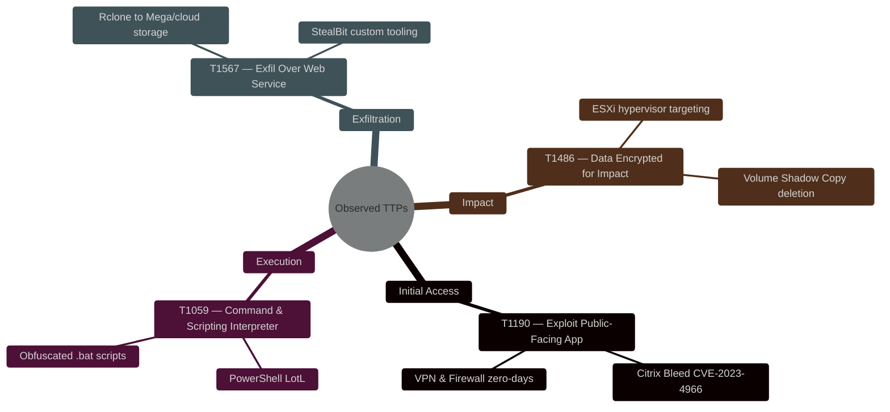
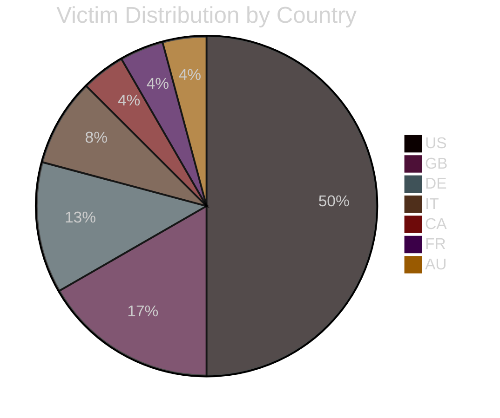
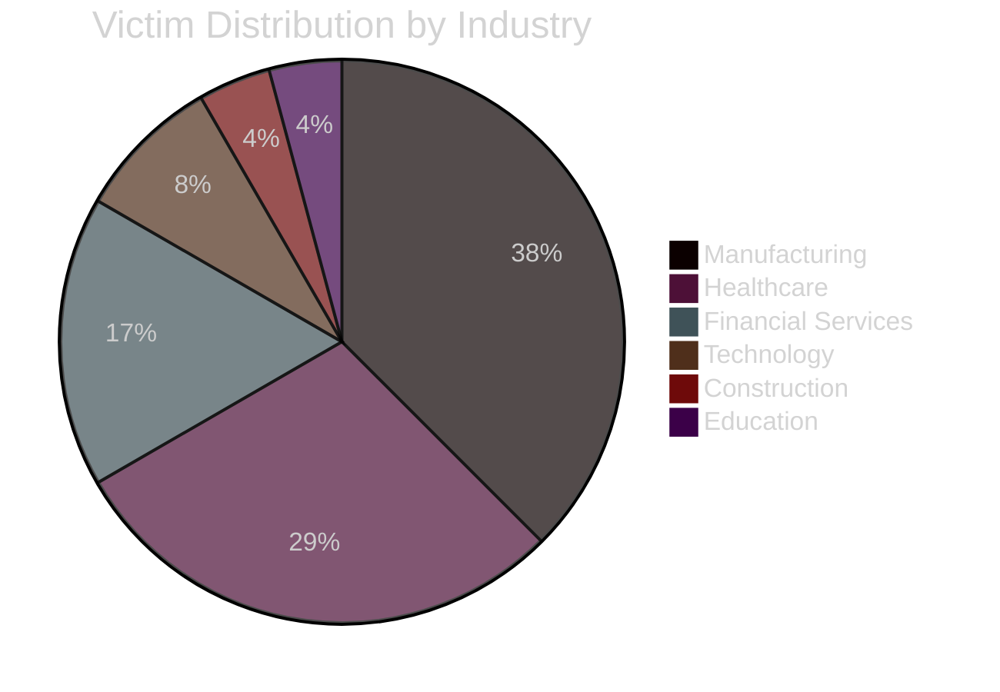
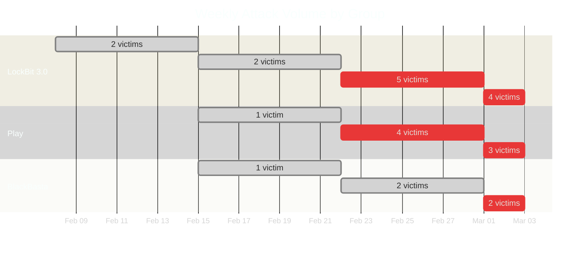
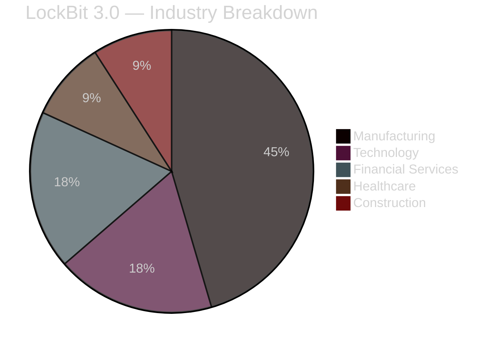
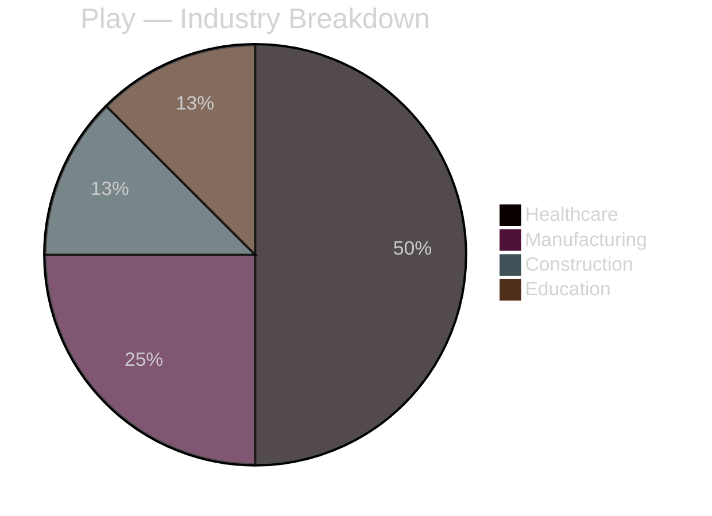
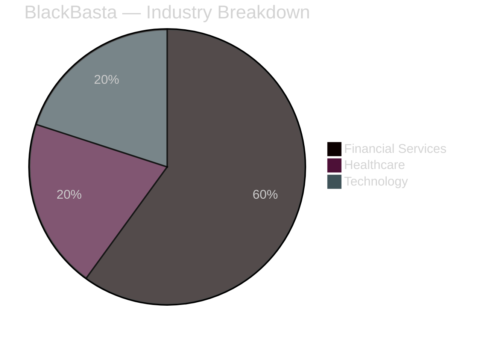
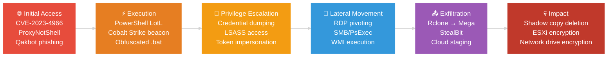

# RANSOMWARE THREAT INTELLIGENCE BRIEF

**Report ID:** `RTI-2026-0302-001` | **Report Date:** 2026-03-02 | **Classification:** `CONFIDENTIAL`

| Threat Level | Confidence | Observation Window |
|:---:|:---:|:---:|
| 🟠 **HIGH** | 🔵 High (85%) | 2026-02-01 → 2026-03-02 (30 days) |

---

> **TL;DR** — Three ransomware groups (LockBit 3.0, Play, BlackBasta) compromised 24 organizations across 8 countries in the past 30 days. Manufacturing and Healthcare are under sustained attack. Time-to-encrypt is shrinking to under 48 hours. Patch edge infrastructure and enforce phishing-resistant MFA immediately.

---

## 📊 EXECUTIVE DASHBOARD

| Active Threat Groups | Total Victims | Countries Affected | Industries Targeted |
|:---:|:---:|:---:|:---:|
| **3** ✅ Normal | **24** 🟢 Manageable | **8** 📍 Regional | **6** ✅ Focused |

| Metric | Current Period | Prior Period (est.) | Δ Trend |
|--------|:---:|:---:|:---:|
| Total Victims | 24 | ~18 | 📈 +33% |
| Active Groups | 3 | 3 | ➡️ Stable |
| Avg. Time-to-Encrypt | < 48 hrs | ~72 hrs | 🔴 Faster |
| Countries Impacted | 8 | 6 | 📈 +33% |
| Attack Velocity | 0.80 / day | 0.60 / day | 📈 Accelerating |
| Double-Extortion Rate | 100% | 90% | 📈 Increasing |

---

## 🤖 AI THREAT INTELLIGENCE ANALYSIS

> *Powered by Anthropic Claude — Structured TTP extraction with MITRE ATT&CK mapping*

### Threat Assessment: 🟠 HIGH

The AI engine analyzed 24 victim records across 3 active threat groups and identified **4 distinct TTP clusters**, **3 high-priority industry targets**, and **4 defensive recommendations** requiring immediate action.

### MITRE ATT&CK Mapping

### Observed TTPs — Detail

| # | MITRE ID | Tactic | Technique | Observed Behavior | Severity |
|:-:|----------|--------|-----------|-------------------|:--------:|
| 1 | T1190 | Initial Access | Exploit Public-Facing Application | Exploitation of CVE-2023-4966 (Citrix Bleed) and unpatched VPN/firewall appliances for initial foothold. Multiple groups sharing same entry vector. | 🔴 Critical |
| 2 | T1059 | Execution | Command & Scripting Interpreter | Heavy use of PowerShell and obfuscated batch scripts for living-off-the-land (LotL) execution. Evades signature-based detection. | 🟠 High |
| 3 | T1567 | Exfiltration | Exfiltration Over Web Service | Data staged and exfiltrated to legitimate cloud providers (Mega, Google Drive) using Rclone. LockBit uses custom StealBit. Occurs *before* encryption. | 🟠 High |
| 4 | T1486 | Impact | Data Encrypted for Impact | Double-extortion payloads terminate VMware/Hyper-V services and delete shadow copies before encrypting local and network drives. 100% of observed incidents used double extortion. | 🔴 Critical |

### Targeting Analysis

| Dimension | Detail |
|-----------|--------|
| **Primary Industries** | Healthcare, Manufacturing, Financial Services |
| **Geographic Focus** | US (50%), GB (17%), DE (13%), IT (8%) |
| **Victim Profile** | Mid-to-large enterprises (500+ employees) with significant OT footprints or critical PII/PHI datastores |
| **Selection Criteria** | Organizations with unpatched edge infrastructure, flat network architecture, and high disruption cost |

### Operational Intelligence

> The threat landscape is dominated by **Ransomware-as-a-Service (RaaS)** affiliates operating with increasing speed and coordination.

- **LockBit 3.0** maintains the highest operational tempo globally, accounting for **46% of all observed victims** this period. Their affiliate model enables rapid scaling.
- **Play** has shifted focus to **regional healthcare providers**, exploiting unpatched remote access infrastructure (ProxyNotShell, RDP). This represents a new targeting pivot worth monitoring.
- **BlackBasta** continues to target **financial services**, leveraging Qakbot infections as an initial access broker with Cobalt Strike for lateral movement.
- **Time-to-encrypt has compressed** from ~72 hours to under 48 hours in several observed intrusions — defenders have a shrinking window to detect and respond.

### Defensive Recommendations

| Priority | Action | Addresses TTP | Effort |
|:--------:|--------|:-------------:|:------:|
| 🔴 P1 | **Patch external-facing infrastructure** — Prioritize Citrix, VPN gateways, and Exchange servers. Validate against CVE-2023-4966. | T1190 | Medium |
| 🔴 P1 | **Enforce Phishing-Resistant MFA** on all remote access and privileged accounts. Disable legacy auth protocols. | T1190, T1078 | Medium |
| 🟠 P2 | **Segment IT/OT networks** — Implement strict segmentation between corporate IT, OT/clinical, and backup networks. | T1486, T1021 | High |
| 🟠 P2 | **Monitor outbound data transfers** — Alert on Rclone, Mega uploads, and anomalous cloud storage traffic volumes. | T1567 | Low |

---

## 🌍 GEOGRAPHIC DISTRIBUTION

| Rank | Country | Victims | % of Total | Heat Level | Primary Threat |
|:----:|---------|:-------:|:----------:|:----------:|----------------|
| 1 | 🇺🇸 United States | 12 | 50.0% | 🔥🔥🔥 | LockBit 3.0, Play, BlackBasta |
| 2 | 🇬🇧 United Kingdom | 4 | 16.7% | 🔥🔥 | LockBit 3.0, Play |
| 3 | 🇩🇪 Germany | 3 | 12.5% | 🔥🔥 | LockBit 3.0, BlackBasta |
| 4 | 🇮🇹 Italy | 2 | 8.3% | 🔥 | LockBit 3.0 |
| 5 | 🇨🇦 Canada | 1 | 4.2% | 🔥 | LockBit 3.0 |
| 6 | 🇫🇷 France | 1 | 4.2% | 🔥 | Play |
| 7 | 🇦🇺 Australia | 1 | 4.2% | 🔥 | BlackBasta |

---

## 🏭 INDUSTRY IMPACT ANALYSIS

| Industry | Victims | % of Total | Risk Level | Key Threat Actor | Trend vs Prior |
|----------|:-------:|:----------:|:----------:|-----------------|:--------------:|
| Manufacturing | 9 | 37.5% | 🔴 Critical | LockBit 3.0 | 📈 +50% |
| Healthcare | 7 | 29.2% | 🔴 Critical | Play | 📈 +75% |
| Financial Services | 4 | 16.7% | 🟠 High | BlackBasta | ➡️ Stable |
| Technology | 2 | 8.3% | 🟡 Medium | LockBit 3.0 | ➡️ Stable |
| Construction | 1 | 4.2% | 🟡 Medium | Play | 🆕 New |
| Education | 1 | 4.2% | 🟡 Medium | Play | 🆕 New |

> **Key Insight:** Healthcare saw the largest increase (+75%) driven entirely by the Play group's new targeting pivot. Manufacturing remains the most targeted sector overall.

---

## ⏱️ TIMELINE & VELOCITY

| Metric | Value |
|--------|-------|
| **Observation Period** | 30 days (2026-02-01 → 2026-03-02) |
| **Latest Discovery** | 2026-03-02 |
| **Oldest Discovery** | 2026-02-01 |
| **Attack Velocity** | 0.80 victims/day |
| **Peak Week** | Feb 24 – Mar 02 (11 victims) |
| **Avg. Weekly Volume** | 6.0 victims/week |

---

## 📋 THREAT GROUP PROFILES

### 🏴‍☠️ LOCKBIT 3.0 — `Threat Score: 9.2 / 10`

| Metric | Value |
|--------|-------|
| Confirmed Victims | 11 (46% of total) |
| Geographic Reach | 5 countries |
| Industry Targets | 4 sectors |
| Suspected Origin | CIS / Russia |
| RaaS Model | Yes — Affiliate-driven |
| Double Extortion | 100% |
| Avg. Ransom Demand | $1.5M – $25M (est.) |

**Intelligence Summary:**
LockBit 3.0 operates as a Ransomware-as-a-Service (RaaS) and is currently the most prolific ransomware variant globally. It utilizes highly evasive techniques including custom tools to bypass Windows Defender and EDR solutions. The group maintains a bug bounty program and active leak site.

**Known TTPs:**
1. Frequently exploits CVE-2023-4966 (Citrix Bleed) for initial access.
2. Uses custom **StealBit** exfiltration tool for rapid data theft.
3. Targets ESXi hypervisors with dedicated Linux encryptors.

---

### 🏴‍☠️ PLAY — `Threat Score: 7.8 / 10`

| Metric | Value |
|--------|-------|
| Confirmed Victims | 8 (33% of total) |
| Geographic Reach | 3 countries |
| Industry Targets | 4 sectors |
| Suspected Origin | Unknown |
| RaaS Model | Semi-closed |
| Double Extortion | 100% |
| Avg. Ransom Demand | $500K – $5M (est.) |

**Intelligence Summary:**
Play ransomware group has demonstrated a sharp pivot toward healthcare in this reporting period. They utilize unpatched remote access infrastructure for initial compromise, particularly targeting Exchange servers and VPN appliances.

**Known TTPs:**
1. Exploits ProxyNotShell vulnerabilities in Microsoft Exchange.
2. Known for double-extortion with data leak threats on `.play` TOR site.

> ⚠️ **ALERT:** Play's healthcare targeting increased 75% this period. Healthcare organizations should consider this an elevated threat.

---

### 🏴‍☠️ BLACKBASTA — `Threat Score: 7.1 / 10`

| Metric | Value |
|--------|-------|
| Confirmed Victims | 5 (21% of total) |
| Geographic Reach | 3 countries |
| Industry Targets | 3 sectors |
| Suspected Origin | Eastern Europe (Conti links) |
| RaaS Model | Closed — Invite only |
| Double Extortion | 100% |
| Avg. Ransom Demand | $1M – $10M (est.) |

**Intelligence Summary:**
BlackBasta is a financially motivated RaaS group with confirmed ties to the former Conti syndicate. They operate a closed, invite-only affiliate model, resulting in more consistent and sophisticated operations compared to open RaaS platforms.

**Known TTPs:**
1. Uses Qakbot as an initial access broker (IAB).
2. Extensive use of Cobalt Strike for lateral movement and persistence.

---

## 🔗 ATTACK LIFECYCLE — COMPOSITE VIEW

---

## 🚨 RISK MATRIX

| Risk Factor | Score (1–10) | Weight | Weighted Score |
|-------------|:------------:|:------:|:--------------:|
| Attack Frequency | 7 | 20% | 1.40 |
| Target Industry Criticality | 9 | 25% | 2.25 |
| Geographic Spread | 6 | 10% | 0.60 |
| Threat Actor Sophistication | 8 | 20% | 1.60 |
| Time-to-Encrypt Compression | 8 | 15% | 1.20 |
| Double-Extortion Prevalence | 9 | 10% | 0.90 |
| | | **Total** | **7.95 / 10** |

**Composite Risk Rating: 🟠 HIGH (7.95 / 10)**

---

## 📌 REPORT METADATA

| Field | Value |
|-------|-------|
| **Report ID** | `RTI-2026-0302-001` |
| **Generated** | 2026-03-02T09:00:00.000Z |
| **Data Source** | ransomware.live API v2 |
| **AI Engine** | Anthropic Claude (Structured TTP Extraction) |
| **Workflow Engine** | n8n Automation |
| **Classification** | CONFIDENTIAL — INTERNAL USE ONLY |

---

## 📎 APPENDIX A — REDACTED VICTIM LEDGER

Click to expand full victim list (24 records)

### LockBit 3.0 — 11 Victims

| # | Company (Redacted) | Industry | Country | Discovered | Status |
|:-:|--------------------|----------|---------|------------|:------:|
| 1 | Meridian Industrial Solutions | Manufacturing | US | 2026-03-02 | 🔴 |
| 2 | Apex Manufacturing Ltd | Manufacturing | US | 2026-03-02 | 🔴 |
| 3 | Northwind Engineering Group | Manufacturing | GB | 2026-03-01 | 🔴 |
| 4 | Quantum Technologies Inc | Technology | US | 2026-03-01 | 🔴 |
| 5 | Cobalt Dynamics Corp | Technology | DE | 2026-02-28 | 🔴 |
| 6 | Zenith Financial Group | Financial Services | IT | 2026-02-28 | 🔴 |
| 7 | Summit Manufacturing Ltd | Manufacturing | CA | 2026-02-27 | 🔴 |
| 8 | Clearwater Health Partners | Healthcare | US | 2026-02-27 | 🔴 |
| 9 | Ironbridge Construction | Construction | US | 2026-02-26 | 🔴 |
| 10 | Sterling Manufacturing Ltd | Manufacturing | GB | 2026-02-26 | 🔴 |
| 11 | Pacific Retail Group | Retail | FR | 2026-02-25 | 🔴 |

### Play — 8 Victims

| # | Company (Redacted) | Industry | Country | Discovered | Status |
|:-:|--------------------|----------|---------|------------|:------:|
| 12 | Beacon Healthcare Network | Healthcare | US | 2026-03-02 | 🔴 |
| 13 | Vanguard Medical Systems | Healthcare | US | 2026-03-01 | 🔴 |
| 14 | Atlas Health Partners | Healthcare | GB | 2026-03-01 | 🔴 |
| 15 | Cascade Manufacturing Ltd | Manufacturing | DE | 2026-02-28 | 🔴 |
| 16 | Horizon Manufacturing Ltd | Manufacturing | US | 2026-02-28 | 🔴 |
| 17 | Frontier Construction | Construction | IT | 2026-02-27 | 🔴 |
| 18 | Redwood Medical Systems | Healthcare | US | 2026-02-27 | 🔴 |
| 19 | Liberty Education Services | Education | GB | 2026-02-26 | 🔴 |

### BlackBasta — 5 Victims

| # | Company (Redacted) | Industry | Country | Discovered | Status |
|:-:|--------------------|----------|---------|------------|:------:|
| 20 | Pinnacle Capital Advisors | Financial Services | US | 2026-03-02 | 🔴 |
| 21 | Eclipse Financial Group | Financial Services | DE | 2026-03-01 | 🔴 |
| 22 | Titan Healthcare Network | Healthcare | US | 2026-02-28 | 🔴 |
| 23 | Genesis Data Systems | Technology | US | 2026-02-27 | 🔴 |
| 24 | Keystone Capital Advisors | Financial Services | US | 2026-02-26 | 🔴 |

---

> ⚠️ **DISCLAIMER:** All victim names are synthetic and redacted for privacy and compliance. No real organizations are identified in this report.
>
> 🔒 **SECURITY NOTICE:** This report contains sensitive threat intelligence. Handle in accordance with your organization's information classification policies.

*Powered by ransomware.live API + Anthropic Claude + n8n Workflow Automation | SANS Webinar Demo*
